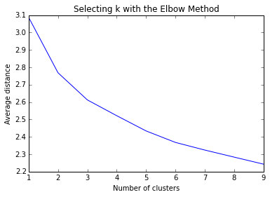

## Assignment : K-Means Clustering

#### Introduction to the assignment

    '''
    Cluster analysis is an unsupervised machine learning method that partitions the observations 
    in a data set into a smaller set of clusters where each observation belongs to only one cluster. 
    
    The goal of cluster analysis is to group, or cluster, observations into subsets based on their 
    similarity of responses on multiple variables. 
    
    In other words, Partitioning 'n' observations (or 'n' columns) with 'm' variables (or 'm' columns) 
    of the dataset into k clusters whereby each observation belongs to only one cluster. 
    
    Clustering variables should be primarily quantitative variables, but binary variables may also 
    be included.
    '''
    print

    
    

#### Summary of the assignment

    '''
    In this project, the cluster analysis is performed using Python and 
    various other libraries.
    
    The scatter plot (below, plot no. 2) of canonical variables for three 
    clusters shows that the two clusters (in Red and Blue) are densely packed, 
    meaning that the observations within the clusters are pretty highly 
    correlated with each other and within cluster variance is relatively low. 
    Also they appear to have good deal of overlap, meaning that there is not 
    good separation between these two clusters.
    
    The cluster (in the green), on the other hand, shows the better
    separation, but the observations are more separated indicating the
    less correlation among the observations and higher with the cluster
    variance.
    
    This suggests that the two cluster solution might be better, meaning 
    that it would be specially important to further evaluate the two cluster
    solution as well.
    
    
    When we calculated 'clustering variable means by cluster', we observed that 
    compared to the other clusters, 'Adolescents' in the third cluster, 'cluster 2', 
    had the highest likelihood of 'having used alcohol [0.95]', but otherwise 
    tended to to fall somewhere in between the other two clusters on the other 
    variables. 
    
    On the other hand, 'cluster one (cluster 0)', clearly includes the most troubled 
    adoloscent who had high likelihood of 'having used alcohol [0.661]' , very high 
    likelyhood of 'using marijuana [1.097]', 'more alcohol problems [0.901]' and more 
    engagement in 'Deviant [1.11]' and 'violant behaviors [0.792]' compared to other 
    two clusters. They also have higher levels of 'Depression [0.854]' and lower 
    'Self esteem [-0.655]'. They also have lowest 'school connectedness [-0.928]', 
    'involvement of parents in activities [-0.409] and preparedness [-0.474]', and 
    'Family connectedness [-0.955]' compared to other two clusters.
    
    Cluster 1, the second cluster appears to have less troubled adoloscents compared 
    to adoloscents in other clusters. They are least likely to use alcohol [-1.056], 
    marijuana [-0.475] and had lowest alcohol problems [-0.413], deviant [-0.451] and 
    violant [-0.264] behaviors. They also have highest 'self esteem [0.207]' and 
    'school connectedness [0.341].
    
    Finally, let's see how clusters differ on GPA.
    
    The analysis of variance summary table indicates that the cluster differed 
    significantly on GPA. :: F-statistic: 133.3  & Prob (F-statistic): 2.50e-56
    When we examine the means, we find that 'Adoloscents' in 'cluster 0' are most 
    troubled group, had the lowest GPA [2.426] and 'Adoloscents' in 'cluster 1', 
    the least troubled group, had the highest GPA [2.995]. 
    
    The 'Tukey test' shows that the clusters differed significantly in mean GPA, 
    although the (absolute) difference between cluster 0 and 2 is minimum [0.4039]
    
    Multiple Comparison of Means - Tukey HSD,FWER=0.05
    =============================================
    group1 group2 meandiff  lower   upper  reject
    ---------------------------------------------
      0      1     0.5685   0.4868  0.6502  True <- Reject
      0      2     0.4039   0.3186  0.4892  True <- Reject
      1      2    -0.1646  -0.2346 -0.0946  True <- Reject
    ---------------------------------------------
    
    
    
    '''

##### Importing libraries and functions required

    from pandas import Series, DataFrame
    import pandas as pd
    import numpy as np
    import matplotlib.pylab as plt
    from sklearn.cross_validation import train_test_split
    from sklearn import preprocessing
    from sklearn.cluster import KMeans
    

    """
    Data Management
    """

    ##### Load Data
    data = pd.read_csv("tree_addhealth.csv")
    

    #upper-case all DataFrame column names
    data.columns = map(str.upper, data.columns)
    

    # Data Cleaning
    data_clean = data.dropna()
    

    # subset clustering variables
    
    cluster = data_clean[['ALCEVR1','MAREVER1','ALCPROBS1','DEVIANT1','VIOL1',
    'DEP1','ESTEEM1','SCHCONN1','PARACTV', 'PARPRES','FAMCONCT']]
    
    cluster.describe()

<table border="1" class="dataframe">
  <thead>
    <tr style="text-align: right;">
      <th></th>
      <th>ALCEVR1</th>
      <th>MAREVER1</th>
      <th>ALCPROBS1</th>
      <th>DEVIANT1</th>
      <th>VIOL1</th>
      <th>DEP1</th>
      <th>ESTEEM1</th>
      <th>SCHCONN1</th>
      <th>PARACTV</th>
      <th>PARPRES</th>
      <th>FAMCONCT</th>
    </tr>
  </thead>
  <tbody>
    <tr>
      <th>count</th>
      <td>4575.000000</td>
      <td>4575.000000</td>
      <td>4575.000000</td>
      <td>4575.000000</td>
      <td>4575.000000</td>
      <td>4575.000000</td>
      <td>4575.000000</td>
      <td>4575.000000</td>
      <td>4575.000000</td>
      <td>4575.000000</td>
      <td>4575.000000</td>
    </tr>
    <tr>
      <th>mean</th>
      <td>0.527432</td>
      <td>0.241967</td>
      <td>0.369180</td>
      <td>2.645027</td>
      <td>1.618579</td>
      <td>8.537049</td>
      <td>40.952131</td>
      <td>28.360656</td>
      <td>6.290710</td>
      <td>13.398033</td>
      <td>22.570557</td>
    </tr>
    <tr>
      <th>std</th>
      <td>0.499302</td>
      <td>0.428321</td>
      <td>0.894947</td>
      <td>3.520554</td>
      <td>2.593230</td>
      <td>6.571052</td>
      <td>5.381439</td>
      <td>5.156385</td>
      <td>3.360219</td>
      <td>2.085837</td>
      <td>2.614754</td>
    </tr>
    <tr>
      <th>min</th>
      <td>0.000000</td>
      <td>0.000000</td>
      <td>0.000000</td>
      <td>0.000000</td>
      <td>0.000000</td>
      <td>0.000000</td>
      <td>18.000000</td>
      <td>6.000000</td>
      <td>0.000000</td>
      <td>3.000000</td>
      <td>6.300000</td>
    </tr>
    <tr>
      <th>25%</th>
      <td>0.000000</td>
      <td>0.000000</td>
      <td>0.000000</td>
      <td>0.000000</td>
      <td>0.000000</td>
      <td>4.000000</td>
      <td>38.000000</td>
      <td>25.000000</td>
      <td>4.000000</td>
      <td>12.000000</td>
      <td>21.700000</td>
    </tr>
    <tr>
      <th>50%</th>
      <td>1.000000</td>
      <td>0.000000</td>
      <td>0.000000</td>
      <td>1.000000</td>
      <td>0.000000</td>
      <td>7.000000</td>
      <td>40.000000</td>
      <td>29.000000</td>
      <td>6.000000</td>
      <td>14.000000</td>
      <td>23.700000</td>
    </tr>
    <tr>
      <th>75%</th>
      <td>1.000000</td>
      <td>0.000000</td>
      <td>0.000000</td>
      <td>4.000000</td>
      <td>2.000000</td>
      <td>12.000000</td>
      <td>45.000000</td>
      <td>32.000000</td>
      <td>9.000000</td>
      <td>15.000000</td>
      <td>24.300000</td>
    </tr>
    <tr>
      <th>max</th>
      <td>1.000000</td>
      <td>1.000000</td>
      <td>6.000000</td>
      <td>27.000000</td>
      <td>19.000000</td>
      <td>48.000000</td>
      <td>50.000000</td>
      <td>38.000000</td>
      <td>18.000000</td>
      <td>15.000000</td>
      <td>25.000000</td>
    </tr>
  </tbody>
</table>

    # standardize clustering variables to have mean=0 and sd=1
    
    clustervar = cluster.copy()
    
    clustervar['ALCEVR1'] = preprocessing.scale(clustervar['ALCEVR1'].astype('float64'))
    
    clustervar['ALCPROBS1'] = preprocessing.scale(clustervar['ALCPROBS1'].astype('float64'))
    
    clustervar['MAREVER1'] = preprocessing.scale(clustervar['MAREVER1'].astype('float64'))
    
    clustervar['DEP1'] = preprocessing.scale(clustervar['DEP1'].astype('float64'))
    
    clustervar['ESTEEM1'] = preprocessing.scale(clustervar['ESTEEM1'].astype('float64'))
    
    clustervar['VIOL1'] = preprocessing.scale(clustervar['VIOL1'].astype('float64'))
    
    clustervar['DEVIANT1'] = preprocessing.scale(clustervar['DEVIANT1'].astype('float64'))
    
    clustervar['FAMCONCT'] = preprocessing.scale(clustervar['FAMCONCT'].astype('float64'))
    
    clustervar['SCHCONN1'] = preprocessing.scale(clustervar['SCHCONN1'].astype('float64'))
    
    clustervar['PARACTV'] = preprocessing.scale(clustervar['PARACTV'].astype('float64'))
    
    clustervar['PARPRES'] = preprocessing.scale(clustervar['PARPRES'].astype('float64'))
    

    clustervar.describe()

<table border="1" class="dataframe">
  <thead>
    <tr style="text-align: right;">
      <th></th>
      <th>ALCEVR1</th>
      <th>MAREVER1</th>
      <th>ALCPROBS1</th>
      <th>DEVIANT1</th>
      <th>VIOL1</th>
      <th>DEP1</th>
      <th>ESTEEM1</th>
      <th>SCHCONN1</th>
      <th>PARACTV</th>
      <th>PARPRES</th>
      <th>FAMCONCT</th>
    </tr>
  </thead>
  <tbody>
    <tr>
      <th>count</th>
      <td>4.575000e+03</td>
      <td>4.575000e+03</td>
      <td>4.575000e+03</td>
      <td>4.575000e+03</td>
      <td>4.575000e+03</td>
      <td>4.575000e+03</td>
      <td>4.575000e+03</td>
      <td>4.575000e+03</td>
      <td>4.575000e+03</td>
      <td>4.575000e+03</td>
      <td>4.575000e+03</td>
    </tr>
    <tr>
      <th>mean</th>
      <td>-1.334209e-16</td>
      <td>1.085713e-16</td>
      <td>2.463603e-16</td>
      <td>4.566111e-16</td>
      <td>-1.370003e-16</td>
      <td>-1.040334e-16</td>
      <td>3.350811e-16</td>
      <td>2.204915e-16</td>
      <td>-2.800431e-17</td>
      <td>4.860714e-17</td>
      <td>-1.759370e-18</td>
    </tr>
    <tr>
      <th>std</th>
      <td>1.000109e+00</td>
      <td>1.000109e+00</td>
      <td>1.000109e+00</td>
      <td>1.000109e+00</td>
      <td>1.000109e+00</td>
      <td>1.000109e+00</td>
      <td>1.000109e+00</td>
      <td>1.000109e+00</td>
      <td>1.000109e+00</td>
      <td>1.000109e+00</td>
      <td>1.000109e+00</td>
    </tr>
    <tr>
      <th>min</th>
      <td>-1.056455e+00</td>
      <td>-5.649816e-01</td>
      <td>-4.125615e-01</td>
      <td>-7.513921e-01</td>
      <td>-6.242240e-01</td>
      <td>-1.299333e+00</td>
      <td>-4.265521e+00</td>
      <td>-4.336972e+00</td>
      <td>-1.872318e+00</td>
      <td>-4.985609e+00</td>
      <td>-6.223275e+00</td>
    </tr>
    <tr>
      <th>25%</th>
      <td>-1.056455e+00</td>
      <td>-5.649816e-01</td>
      <td>-4.125615e-01</td>
      <td>-7.513921e-01</td>
      <td>-6.242240e-01</td>
      <td>-6.905356e-01</td>
      <td>-5.486365e-01</td>
      <td>-6.518177e-01</td>
      <td>-6.817892e-01</td>
      <td>-6.703234e-01</td>
      <td>-3.329768e-01</td>
    </tr>
    <tr>
      <th>50%</th>
      <td>9.465623e-01</td>
      <td>-5.649816e-01</td>
      <td>-4.125615e-01</td>
      <td>-4.673149e-01</td>
      <td>-6.242240e-01</td>
      <td>-2.339378e-01</td>
      <td>-1.769481e-01</td>
      <td>1.240043e-01</td>
      <td>-8.652477e-02</td>
      <td>2.886289e-01</td>
      <td>4.319970e-01</td>
    </tr>
    <tr>
      <th>75%</th>
      <td>9.465623e-01</td>
      <td>-5.649816e-01</td>
      <td>-4.125615e-01</td>
      <td>3.849169e-01</td>
      <td>1.470994e-01</td>
      <td>5.270586e-01</td>
      <td>7.522730e-01</td>
      <td>7.058709e-01</td>
      <td>8.063718e-01</td>
      <td>7.681051e-01</td>
      <td>6.614892e-01</td>
    </tr>
    <tr>
      <th>max</th>
      <td>9.465623e-01</td>
      <td>1.769969e+00</td>
      <td>6.292479e+00</td>
      <td>6.918694e+00</td>
      <td>6.703348e+00</td>
      <td>6.006232e+00</td>
      <td>1.681494e+00</td>
      <td>1.869604e+00</td>
      <td>3.485062e+00</td>
      <td>7.681051e-01</td>
      <td>9.292300e-01</td>
    </tr>
  </tbody>
</table>

#####  Create Training and Testing Data Sets

    # split data into train and test sets
    clus_train, clus_test = train_test_split(clustervar, test_size=.3, random_state=123)

    # k-means cluster analysis for 1-9 clusters                                                           
    
    from scipy.spatial.distance import cdist
    clusters = range(1,10)
    meandist = []
    
    for k in clusters:
        model=KMeans(n_clusters=k)
        model.fit(clus_train)
        clusassign=model.predict(clus_train)
        meandist.append(sum(np.min(cdist(clus_train, model.cluster_centers_, 'euclidean'), axis=1)) 
        / clus_train.shape[0])
    

    """
    Plot average distance from observations from the cluster centroid
    to use the Elbow Method to identify number of clusters to choose
    """
    

    %matplotlib inline

    plt.plot(clusters, meandist)
    plt.xlabel('Number of clusters')
    plt.ylabel('Average distance')
    plt.title('Selecting k with the Elbow Method')
    

    <matplotlib.text.Text at 0x1f5a9a90>

    # Interpret 3 cluster solution
    model3 = KMeans(n_clusters = 3)
    
    model3.fit(clus_train)
    
    clusassign = model3.predict(clus_train)
    

    # plot clusters
    
    from sklearn.decomposition import PCA
    pca_2 = PCA(2)
    plot_columns = pca_2.fit_transform(clus_train)
    plt.scatter(x = plot_columns[:,0], y = plot_columns[:, 1], c = model3.labels_,)
    plt.xlabel('Canonical variable 1')
    plt.ylabel('Canonical variable 2')
    plt.title('Scatterplot of Canonical Variables for 3 Clusters')
    plt.show()
    

    """
    BEGIN multiple steps to merge cluster assignment with clustering variables to examine
    cluster variable means by cluster
    """

    # create a unique identifier variable from the index for the 
    # cluster training data to merge with the cluster assignment variable
    clus_train.reset_index(level = 0, inplace = True)
    

    # create a list that has the new index variable
    cluslist = list(clus_train['index'])
    

    # create a list of cluster assignments
    labels = list(model3.labels_)

    # combine index variable list with cluster assignment list into a dictionary
    newlist = dict(zip(cluslist, labels))
    
    #print(newlist)
    
    # Printing only first 20 records
    n = 20
    #{key:value for key,value in newlist.items()[0:n]}
    print("Key, Value:"), newlist.items()[0:20]

    Key, Value: [(1, 1), (3, 2), (5, 0), (6, 0), (7, 2), (8, 1), (9, 0), (10, 0), (11, 0), (12, 0), (14, 0), (17, 0), (20, 1), (22, 2), (23, 1), (26, 0), (27, 1), (29, 0), (30, 1), (33, 2)]
    

    # convert newlist dictionary to a dataframe
    newclus = DataFrame.from_dict(newlist, orient = 'index')
    
    newclus.head()

<table border="1" class="dataframe">
  <thead>
    <tr style="text-align: right;">
      <th></th>
      <th>0</th>
    </tr>
  </thead>
  <tbody>
    <tr>
      <th>1</th>
      <td>2</td>
    </tr>
    <tr>
      <th>3</th>
      <td>0</td>
    </tr>
    <tr>
      <th>5</th>
      <td>1</td>
    </tr>
    <tr>
      <th>6</th>
      <td>1</td>
    </tr>
    <tr>
      <th>7</th>
      <td>0</td>
    </tr>
  </tbody>
</table>

    # rename the cluster assignment column
    newclus.columns = ['cluster']

    # now do the same for the cluster assignment variable
    # create a unique identifier variable from the index for the 
    # cluster assignment dataframe 
    # to merge with cluster training data
    newclus.reset_index(level = 0, inplace = True)

    # merge the cluster assignment dataframe with the cluster training 
    # variable dataframe by the index variable
    merged_train = pd.merge(clus_train, newclus, on = 'index')
    merged_train.head(n = 5)

<table border="1" class="dataframe">
  <thead>
    <tr style="text-align: right;">
      <th></th>
      <th>index</th>
      <th>ALCEVR1</th>
      <th>MAREVER1</th>
      <th>ALCPROBS1</th>
      <th>DEVIANT1</th>
      <th>VIOL1</th>
      <th>DEP1</th>
      <th>ESTEEM1</th>
      <th>SCHCONN1</th>
      <th>PARACTV</th>
      <th>PARPRES</th>
      <th>FAMCONCT</th>
      <th>cluster</th>
    </tr>
  </thead>
  <tbody>
    <tr>
      <th>0</th>
      <td>2559</td>
      <td>-1.056455</td>
      <td>-0.564982</td>
      <td>-0.412562</td>
      <td>-0.751392</td>
      <td>-0.624224</td>
      <td>-0.994934</td>
      <td>-0.176948</td>
      <td>0.705871</td>
      <td>-0.086525</td>
      <td>0.768105</td>
      <td>0.546743</td>
      <td>1</td>
    </tr>
    <tr>
      <th>1</th>
      <td>820</td>
      <td>-1.056455</td>
      <td>-0.564982</td>
      <td>-0.412562</td>
      <td>0.384917</td>
      <td>-0.624224</td>
      <td>-0.842735</td>
      <td>-1.106169</td>
      <td>0.317960</td>
      <td>-0.384157</td>
      <td>0.768105</td>
      <td>0.279002</td>
      <td>1</td>
    </tr>
    <tr>
      <th>2</th>
      <td>1683</td>
      <td>0.946562</td>
      <td>-0.564982</td>
      <td>-0.412562</td>
      <td>-0.183238</td>
      <td>-0.624224</td>
      <td>-0.994934</td>
      <td>1.123961</td>
      <td>-0.651818</td>
      <td>2.294533</td>
      <td>0.288629</td>
      <td>0.279002</td>
      <td>2</td>
    </tr>
    <tr>
      <th>3</th>
      <td>5492</td>
      <td>0.946562</td>
      <td>1.769969</td>
      <td>-0.412562</td>
      <td>-0.467315</td>
      <td>-0.624224</td>
      <td>-1.147133</td>
      <td>1.681494</td>
      <td>1.093782</td>
      <td>0.211107</td>
      <td>0.768105</td>
      <td>0.929230</td>
      <td>2</td>
    </tr>
    <tr>
      <th>4</th>
      <td>4763</td>
      <td>-1.056455</td>
      <td>-0.564982</td>
      <td>-0.412562</td>
      <td>-0.467315</td>
      <td>-0.624224</td>
      <td>1.744653</td>
      <td>0.008896</td>
      <td>-2.009506</td>
      <td>0.211107</td>
      <td>0.768105</td>
      <td>0.546743</td>
      <td>1</td>
    </tr>
  </tbody>
</table>

    # cluster frequencies
    merged_train.cluster.value_counts()

    1    1420
    2    1108
    0     674
    dtype: int64

    """
    END multiple steps to merge cluster assignment with clustering variables
    to examine cluster variable means by cluster
    """

    # FINALLY calculate clustering variable means by cluster
    clustergrp = merged_train.groupby('cluster').mean()
    print ("Clustering Variable Means by Cluster")
    print(clustergrp)
    

    Clustering Variable Means by Cluster
                   index   ALCEVR1  MAREVER1  ALCPROBS1  DEVIANT1     VIOL1  \
    cluster                                                                   
    0        3312.255193  0.661266  1.097891   0.900592  1.106490  0.791967   
    1        3239.829577 -1.056455 -0.474543  -0.412562 -0.451110 -0.264092   
    2        3328.930505  0.946562 -0.057109  -0.058550 -0.121192 -0.168252   
    
                 DEP1   ESTEEM1  SCHCONN1   PARACTV   PARPRES  FAMCONCT  
    cluster                                                              
    0        0.853587 -0.655070 -0.927499 -0.409328 -0.473980 -0.955398  
    1       -0.292352  0.206912  0.341590  0.091216  0.156604  0.298288  
    2       -0.196987  0.188367  0.131356  0.151205  0.099521  0.226842  
    

    # validate clusters in training data by examining cluster 
    # differences in GPA using ANOVA. first have to merge GPA 
    # with clustering variables and cluster assignment data 
    gpa_data = data_clean['GPA1']

    # split GPA data into train and test sets
    gpa_train, gpa_test = train_test_split(gpa_data, test_size=.3, random_state=123)
    gpa_train1 = pd.DataFrame(gpa_train)
    gpa_train1.reset_index(level = 0, inplace = True)
    merged_train_all = pd.merge(gpa_train1, merged_train, on = 'index')
    sub1 = merged_train_all[['GPA1', 'cluster']].dropna()
    

    # Import modules
    import statsmodels.formula.api as smf
    import statsmodels.stats.multicomp as multi 
    

    gpamod = smf.ols(formula = 'GPA1 ~ C(cluster)', data=sub1).fit()
    print (gpamod.summary())

                                OLS Regression Results                            
    ==============================================================================
    Dep. Variable:                   GPA1   R-squared:                       0.077
    Model:                            OLS   Adj. R-squared:                  0.076
    Method:                 Least Squares   F-statistic:                     133.3
    Date:                Sun, 28 Feb 2016   Prob (F-statistic):           2.50e-56
    Time:                        14:57:49   Log-Likelihood:                -3599.3
    No. Observations:                3202   AIC:                             7205.
    Df Residuals:                    3199   BIC:                             7223.
    Df Model:                           2                                         
    Covariance Type:            nonrobust                                         
    ===================================================================================
                          coef    std err          t      P>|t|      [95.0% Conf. Int.]
    -----------------------------------------------------------------------------------
    Intercept           2.4261      0.029     84.546      0.000         2.370     2.482
    C(cluster)[T.1]     0.5685      0.035     16.314      0.000         0.500     0.637
    C(cluster)[T.2]     0.4039      0.036     11.098      0.000         0.333     0.475
    ==============================================================================
    Omnibus:                      154.326   Durbin-Watson:                   2.019
    Prob(Omnibus):                  0.000   Jarque-Bera (JB):               92.624
    Skew:                          -0.277   Prob(JB):                     7.71e-21
    Kurtosis:                       2.377   Cond. No.                         4.64
    ==============================================================================
    
    Warnings:
    [1] Standard Errors assume that the covariance matrix of the errors is correctly specified.
    

    print ('means for GPA by cluster')
    m1= sub1.groupby('cluster').mean()
    print (m1)
    

    means for GPA by cluster
                 GPA1
    cluster          
    0        2.426063
    1        2.994542
    2        2.829949
    

    print ('standard deviations for GPA by cluster')
    m2 = sub1.groupby('cluster').std()
    print (m2)
    

    standard deviations for GPA by cluster
                 GPA1
    cluster          
    0        0.786903
    1        0.738174
    2        0.727230
    

    mc1 = multi.MultiComparison(sub1['GPA1'], sub1['cluster'])
    res1 = mc1.tukeyhsd()
    print(res1.summary())
    

    Multiple Comparison of Means - Tukey HSD,FWER=0.05
    =============================================
    group1 group2 meandiff  lower   upper  reject
    ---------------------------------------------
      0      1     0.5685   0.4868  0.6502  True 
      0      2     0.4039   0.3186  0.4892  True 
      1      2    -0.1646  -0.2346 -0.0946  True 
    ---------------------------------------------
    
